# agent-bedrock

## Architecture

```mermaid
graph TB
    User[User Input] --> Agent[Agent Core]
    Agent --> Memory[Memory Manager]
    Agent --> Tools[Tool Executor]
    Agent --> MCP[MCP Client Manager]
    Agent --> Bedrock[AWS Bedrock API]
    
    Memory --> ShortTerm[Short-term Cache]
    Memory --> LongTerm[Long-term Storage]
    
    Tools --> LocalTools[Local Tools]
    MCP --> RemoteTools[MCP Server Tools]
    MCP --> Resources[MCP Resources]
    
    Bedrock --> Stream[Streaming Response]
    Bedrock --> Guardrails[Content Filtering]
    
    Agent --> Observability[AWS Powertools]
    Observability --> Logs[Logger]
    Observability --> Metrics[Metrics]
    Observability --> Traces[Tracer]
    
    Stream --> Response[Agent Response]
    
    style Agent fill:#ff9900
    style Bedrock fill:#232f3e
    style MCP fill:#4a90e2
```



## Features

- **Streaming Responses** - Real-time output via ConverseStream API
- **Tool Integration** - Local tools + remote MCP server tools
- **Memory Management** - Short-term cache + long-term persistence
- **Multimodal Content** - Text, images, documents, video
- **Guardrails** - Built-in content filtering
- **Observability** - AWS Powertools (logs, metrics, traces)
- **Type-Safe** - Full TypeScript support

## Installation

```bash
npm install agent-bedrock
```

## Quick Start

```typescript
import { Agent } from 'agent-bedrock';

const agent = new Agent({
  name: 'my-agent',
  modelId: 'eu.amazon.nova-micro-v1:0'
});

const response = await agent.converse({
  message: 'Hello, how can you help me?'
});

console.log(response.message);
```

## Examples

### Local Tools

```typescript
const weatherTool = {
  name: 'get_weather',
  description: 'Get current weather for a location',
  inputSchema: {
    type: 'object',
    properties: {
      location: { type: 'string', description: 'City name' }
    },
    required: ['location']
  },
  handler: async (input) => ({
    location: input.location,
    temperature: 72,
    condition: 'Sunny'
  })
};

const agent = new Agent({
  name: 'tool-agent',
  modelId: 'eu.amazon.nova-micro-v1:0',
  tools: [weatherTool]
});
```

### Memory

```typescript
const agent = new Agent({
  name: 'persistent-agent',
  modelId: 'eu.amazon.nova-micro-v1:0',
  memory: {
    shortTerm: {
      maxMessages: 20,
      maxTokens: 4000
    },
    longTerm: {
      fetch: async (sessionId) => await db.getConversation(sessionId),
      save: async (sessionId, messages) => await db.saveConversation(sessionId, messages)
    }
  }
});

await agent.converse({ message: 'My name is Alice', sessionId: 'user-123' });
const response = await agent.converse({ message: 'What is my name?', sessionId: 'user-123' });
```

### Multimodal

```typescript
import { createImageFromS3 } from 'bedrock-agent-framework';

const image = createImageFromS3({
  format: 'jpeg',
  uri: 's3://my-bucket/images/photo.jpg'
});

const response = await agent.converse({
  message: [
    { text: 'What do you see in this image?' },
    image
  ]
});
```

### Guardrails

```typescript
const agent = new Agent({
  name: 'safe-agent',
  modelId: 'eu.amazon.nova-micro-v1:0',
  guardrail: {
    guardrailId: 'your-guardrail-id',
    guardrailVersion: '1',
    trace: true
  }
});

const response = await agent.converse({ message: 'Your message here' });

if (response.guardrailAction?.action === 'INTERVENED') {
  console.log('Content blocked by guardrail');
}
```

### MCP Integration

Connect to remote MCP servers for external tools and resources.

```typescript
const agent = new Agent({
  name: 'mcp-agent',
  modelId: 'eu.amazon.nova-micro-v1:0',
  mcpServers: [
    {
      name: 'weather-service',
      url: 'https://api.example.com/mcp',
      description: 'Weather data provider'
    },
    {
      name: 'database',
      url: 'https://db.example.com/mcp',
      authentication: {
        type: 'bearer',
        token: process.env.DB_API_TOKEN
      },
      toolFilter: {
        deniedTools: ['delete_customer', 'drop_table']
      },
      reconnect: {
        enabled: true,
        maxAttempts: 5,
        delayMs: 2000
      }
    }
  ]
});

// Agent can use both local and MCP tools
const response = await agent.converse({
  message: 'What is the weather in Seattle?'
});
```

### Streaming

```typescript
const agent = new Agent({
  name: 'streaming-agent',
  modelId: 'eu.amazon.nova-micro-v1:0',
  streaming: true
});

await agent.converse({
  message: 'Tell me a story',
  onStreamChunk: (chunk) => process.stdout.write(chunk.text || '')
});
```

### Dynamic MCP Management

```typescript
// Attach server at runtime
await agent.attachMcpServer({
  name: 'new-service',
  url: 'https://service.example.com/mcp',
  authentication: { type: 'bearer', token: process.env.SERVICE_TOKEN }
});

// List MCP tools
const tools = await agent.listMcpTools();

// Access MCP resources
const resource = await agent.getMcpResource('mcp://server-name/path/to/resource');
```

## Configuration

### Full Agent Config

```typescript
import { Agent } from 'bedrock-agent-framework';
import { Logger } from '@aws-lambda-powertools/logger';

const agent = new Agent({
  name: 'advanced-agent',
  modelId: 'eu.amazon.nova-micro-v1:0',
  description: 'Customer support agent',
  region: 'us-east-1',
  streaming: true,
  
  modelConfig: {
    temperature: 0.7,
    maxTokens: 2048,
    topP: 0.9,
    stopSequences: ['Human:', 'Assistant:']
  },
  
  logger: new Logger({ logLevel: 'DEBUG' }),
  enableMetrics: true,
  enableTracing: true,
  
  tools: [/* your tools */],
  
  guardrail: {
    guardrailId: 'abc123',
    guardrailVersion: '1'
  },
  
  memory: {
    shortTerm: {
      maxMessages: 20,
      maxTokens: 4000
    },
    longTerm: {
      fetch: async (sessionId) => await db.getConversation(sessionId),
      save: async (sessionId, messages) => await db.saveConversation(sessionId, messages)
    }
  },
  
  mcpServers: [
    {
      name: 'external-api',
      url: 'https://api.example.com/mcp',
      authentication: {
        type: 'bearer',
        token: process.env.API_TOKEN
      }
    }
  ]
});
```

## API Reference

### AgentConfig

```typescript
interface AgentConfig {
  name: string;
  modelId: string;
  bedrockClient?: BedrockRuntimeClient;
  region?: string;
  logger?: Logger;
  enableMetrics?: boolean;
  enableTracing?: boolean;
  modelConfig?: ModelConfig;
  description?: string;
  streaming?: boolean;
  tools?: ToolDefinition[];
  guardrail?: GuardrailConfig;
  memory?: MemoryConfig;
  mcpServers?: McpServerConfig[];
}
```

### McpServerConfig

```typescript
interface McpServerConfig {
  name: string;
  url: string;
  description?: string;
  authentication?: McpAuthConfig;
  reconnect?: McpReconnectConfig;
  toolFilter?: McpToolFilter;
  customHeaders?: Record<string, string>;
}
```

### McpAuthConfig

```typescript
interface McpAuthConfig {
  type: 'bearer' | 'custom';
  token?: string;
  headers?: Record<string, string>;
}
```

### McpReconnectConfig

```typescript
interface McpReconnectConfig {
  enabled?: boolean;      // Default: true
  maxAttempts?: number;   // Default: 3
  delayMs?: number;       // Default: 1000
}
```

### McpToolFilter

```typescript
interface McpToolFilter {
  allowedTools?: string[];  // Whitelist
  deniedTools?: string[];   // Blacklist
}
```

### ToolDefinition

```typescript
interface ToolDefinition {
  name: string;
  description: string;
  inputSchema: {
    type: 'object';
    properties: Record<string, unknown>;
    required?: string[];
  };
  handler: (input: unknown) => Promise<unknown>;
}
```

### Agent Methods

```typescript
// Conversation
converse(options: ConverseOptions): Promise<ConverseResponse>

// MCP Management
attachMcpServer(config: McpServerConfig): Promise<void>
detachMcpServer(name: string): Promise<void>
listMcpTools(): Promise<ToolInfo[]>
getMcpResource(uri: string): Promise<ResourceContent>
```

### Utility Functions

```typescript
// Multimodal content creation
createImageFromS3(options: ImageFromS3Options): ImageContent
createImageFromBytes(options: ImageFromBytesOptions): ImageContent
createDocumentFromS3(options: DocumentFromS3Options): DocumentContent
createDocumentFromBytes(options: DocumentFromBytesOptions): DocumentContent
createVideoFromS3(options: VideoFromS3Options): VideoContent

// PII sanitization
sanitizeString(text: string, config?: SanitizeConfig): string
```

## Error Handling

```typescript
import { ValidationError, McpError, ToolExecutionError } from 'bedrock-agent-framework';

try {
  const response = await agent.converse({ message: 'Hello' });
} catch (error) {
  if (error instanceof ValidationError) {
    console.error('Validation failed:', error.message);
  } else if (error instanceof McpError) {
    console.error('MCP error:', error.message);
  } else if (error instanceof ToolExecutionError) {
    console.error('Tool execution failed:', error.message);
  }
}
```

## Development

```bash
npm install    # Install dependencies
npm test       # Run tests
npm run build  # Build
npm run lint   # Lint
```